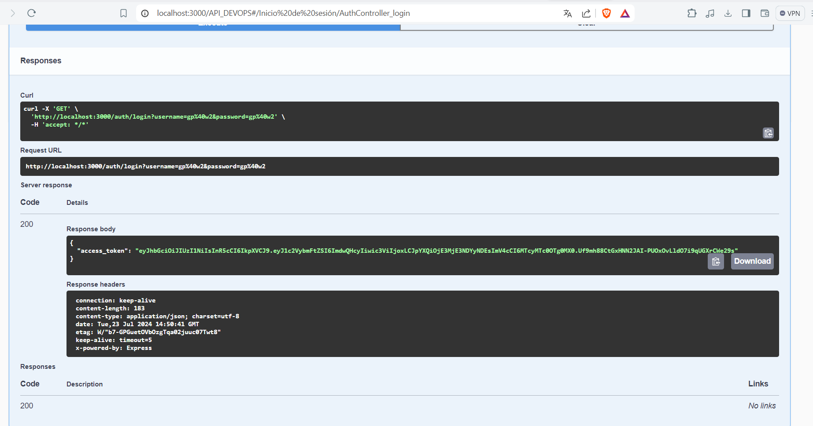
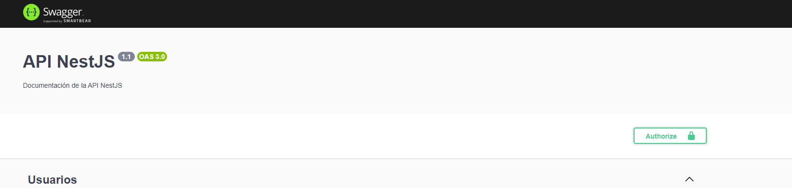
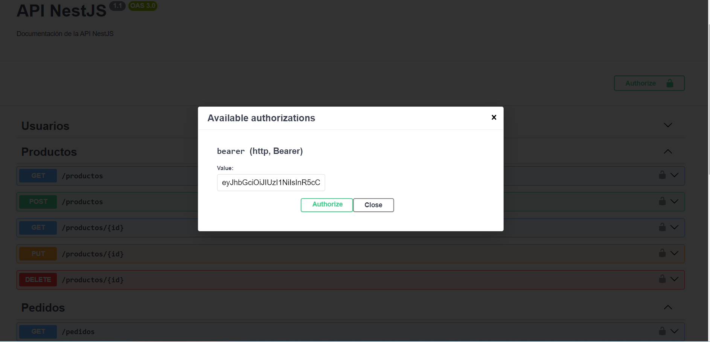
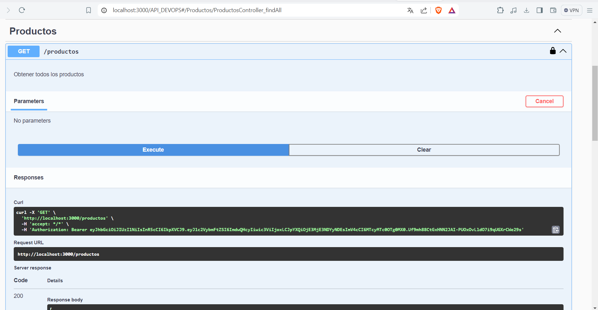

<p align="center">
  <a href="http://nestjs.com/" target="blank"></a>
</p>

[circleci-image]: https://img.shields.io/circleci/build/github/nestjs/nest/master?token=abc123def456
[circleci-url]: https://circleci.com/gh/nestjs/nest

  <p align="center">A progressive <a href="http://nodejs.org" target="_blank">Node.js</a> framework for building efficient and scalable server-side applications.</p>
    <p align="center">
<a href="https://www.npmjs.com/~nestjscore" target="_blank"></a>
<a href="https://www.npmjs.com/~nestjscore" target="_blank"></a>
<a href="https://www.npmjs.com/~nestjscore" target="_blank"></a>
<a href="https://circleci.com/gh/nestjs/nest" target="_blank"></a>
<a href="https://coveralls.io/github/nestjs/nest?branch=master" target="_blank"></a>
<a href="https://discord.gg/G7Qnnhy" target="_blank"></a>
<a href="https://opencollective.com/nest#backer" target="_blank"></a>
<a href="https://opencollective.com/nest#sponsor" target="_blank"></a>
  <a href="https://paypal.me/kamilmysliwiec" target="_blank"></a>
    <a href="https://opencollective.com/nest#sponsor"  target="_blank"></a>
  <a href="https://twitter.com/nestframework" target="_blank"></a>
</p>
  <!--[](https://opencollective.com/nest#backer)
  [](https://opencollective.com/nest#sponsor)-->

## Description

[Nest](https://github.com/nestjs/nest) framework TypeScript starter repository.

## Installation

```bash
$ npm install
```

## Running the app

```bash
# development
$ npm run start

# watch mode
$ npm run start:dev

# production mode
$ npm run start:prod
```

## Test

```bash
# unit tests
$ npm run test

# e2e tests
$ npm run test:e2e

# test coverage
$ npm run test:cov
```

<!-- ## Support

Nest is an MIT-licensed open source project. It can grow thanks to the sponsors and support by the amazing backers. If you'd like to join them, please [read more here](https://docs.nestjs.com/support).

## Stay in touch

- Author - [Kamil Myśliwiec](https://kamilmysliwiec.com)
- Website - [https://nestjs.com](https://nestjs.com/)
- Twitter - [@nestframework](https://twitter.com/nestframework)

## License

Nest is [MIT licensed](LICENSE). -->

## ScreenShots

Link acceso carpeta [ScreenShot](https://github.com/jemga98/app-api-gabriel-p/tree/main/screenshots).


# Instrucciones del proyecto

En el botón verde [Code] dar click y seleccionar opción [Open with GitHub Desktop] para clonar el repositorio.

- Dato importante: tiene que tener instalado y configurado PostgreSQL para que la conexión sea exitosa.

Después de haberlo clonado abrirlo con visual studio code abrir la terminal y cambiarse a la rama setup-nestjs y ejecutar el comando npm run start.

En caso de que da error al ejecutar el comando npm run start, asegurese de tener instalado TypeORM y PostgreSQL con este comando npm install --save @nestjs/typeorm typeorm pg.

Y luego volver a ejeuctar el comando npm run start y probar las API con postman.

- En la carpeta src se encuentran las subcarpetas que son referenciadas a los endpoint de las API desarrolladas, las carpetas son las siguiente: pedidos, productos y usuarios.

Para probar cada una de las API tendrias que construir la url de esta manera http://localhost:3000/pedidos

- A excepción de la API de Inicio de sesión porque la url tendrá este endpoint http://localhost:3000/auth/login


## Para probar el API protegida con seguridad de token al iniciar sesión

Para probar el API protegida con seguridad de token al iniciar sesión, se genera un token como se muestra en la imagen, a partir de allí copiar ese token:



## Después de haber copiado el token, dar click en el botón Authorize



## Copiar el token dentro de la caja de texto, como se muestra en imagen y dar click en el botón Authorize



Y listo ahora puede realizar cualquier solicitud a la API

## A continuación se muestra una solicitud realizada al endpoint usuario en el cual, aparece la autorización del token ingresado previamente




## El link de acceso a la API en la nube, asegúrate de dar click en la nube

[](https://appnestapi.onrender.com/API_DEVOPS)